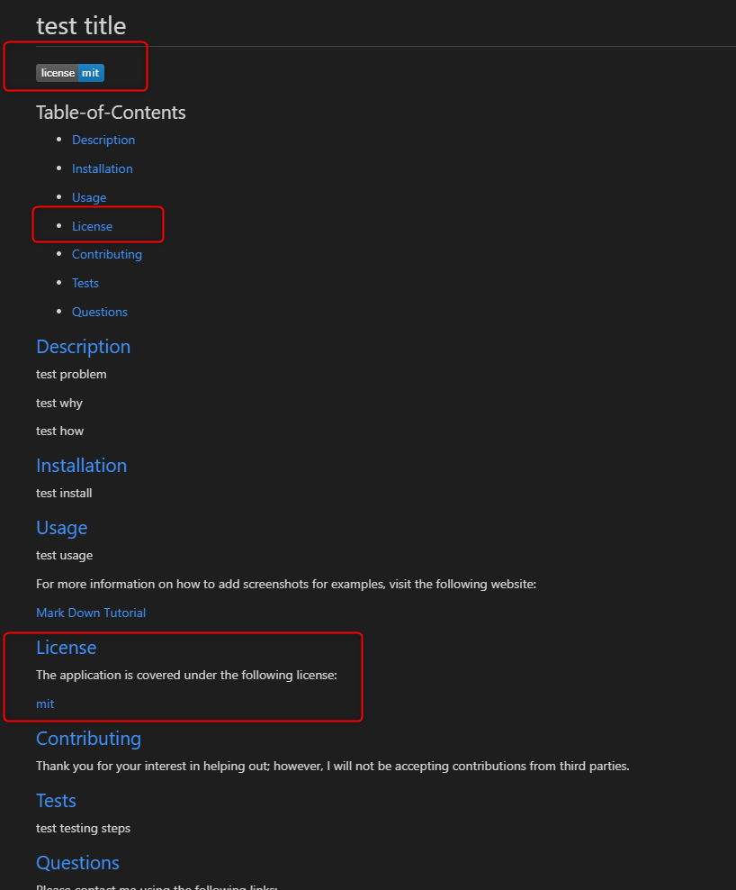

# GenerateMyREADME

## Project Videos

Short Video DEMO:
https://drive.google.com/file/d/1HPXcuCAkbYZmGpsXnEhh0w71IwG7dP4C/view

STEPbySTEP Walkthrough:
https://drive.google.com/file/d/1yWWoNEZQuXFdMpTepaHYp7zq_w1VUCo0/view

## Acceptance Criteria
```
GIVEN a command-line application that accepts user input
WHEN I am prompted for information about my application repository
THEN a high-quality, professional README.md is generated with the title of my project and sections entitled Description, Table of Contents, Installation, Usage, License, Contributing, Tests, and Questions
WHEN I enter my project title
THEN this is displayed as the title of the README
WHEN I enter a description, installation instructions, usage information, contribution guidelines, and test instructions
THEN this information is added to the sections of the README entitled Description, Installation, Usage, Contributing, and Tests
WHEN I choose a license for my application from a list of options
THEN a badge for that license is added near the top of the README and a notice is added to the section of the README entitled License that explains which license the application is covered under
WHEN I enter my GitHub username
THEN this is added to the section of the README entitled Questions, with a link to my GitHub profile
WHEN I enter my email address
THEN this is added to the section of the README entitled Questions, with instructions on how to reach me with additional questions
WHEN I click on the links in the Table of Contents
THEN I am taken to the corresponding section of the README
```

## Table-of-Contents

* [Description](#description)
* [Installation](#installation)
* [Usage](#usage)

* [Contributing](#contributing)
* [Tests](#tests)
* [Questions](#questions)

## [Description](#table-of-contents)

My project is a README generator. The project will help a user generate a README without having to worry about applying proper mark down syntax.

One problem with most projects is that the README is overlooked. This could be because the developer is lazy and doesn't want to include it or they haven't mastered down the proper syntax to creating a README. Also they possibly don't have a good idea of what to include with the README.

This README generator will allow the user to answer a series of specific questions and create a professional complete README based on their responses. It will take a couple minutes and provide the developer with the ability to make their project complete and more professional, increasing the likely hood that someone will want to use their app over similar apps without a README.

## [Installation](#table-of-contents)

Click the repository link below. Download the zip file and copy it to a directory of your choice or clone to a directory of your choice using your terminal.  Open the file in VS Code or whatever editor you work with. Open the terminal in VS Code and make sure you’re in the root directory ‘challenge-9-professional-README-generator. You’ll now be ready to run the app!

[README Generator Download Link](https://github.com/mjgiannelli/challenge-9-professional-README-generator/)

[ZIP file download Tutorial](https://drive.google.com/file/d/1Es77aULk006BU_krKsyRvkA5YwO5_yvE/view)

[Git Clone download Tutorial](https://drive.google.com/file/d/1i-yD756_Ibe_SUFfAvNI3cTmBkNMfbiq/view)

[Tutorial on how to use app](https://drive.google.com/file/d/1D2fBbKYpz3s7xbjWTj9DZnJrpr12AgbM/view)

README Screenshot No License


README Screenshot with License


## [Usage](#table-of-contents)

After installation is complete, run the following code: ‘node index.js’ in the terminal. Answer the prompts and after completion, you should see a console log showing your answers to your prompts, a message that says ‘File created!’, and you should see your file under the ‘dist’ folder called ‘generatedREADME’. It’s generated in mark down syntax so you can copy and paste that code into your project!

For more information on how to add screenshots for examples, visit the following website:


## [Contributing](#table-of-contents)


Thank you for your interest in helping out; however, I will not be accepting contributions from third parties.


## [Tests](#table-of-contents)

To test this app, open up the file in VS Code. Open the terminal, change directory into the root folder ‘challenge-9-professional-README-generator’, and run ‘node index.js’. Answer the prompts and view the preview of the ‘generated-README.md’ file in the ‘dist’ folder.

## [Questions](#table-of-contents)

Please contact me using the following links:

[GitHub](https://github.com/cboensch6505)

[Email: cboensch6505@gmail.com](mailto:cboensch6505@gmail.com)
